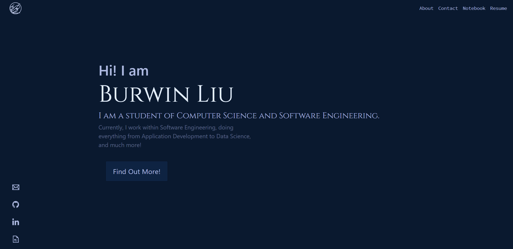

# personalWebsite
This is the main entry point to my website, which is found at burwinliu.github.io under my repos.   
This project involves the use of Vue as the main web technology, with various vue helpers (cli, vuex, svg-loader, bootstrap-vue, vue-router)  
To build it yourself, simply run the command npm run serve, or to build a dist use npm run build.  

## Color schemes
Find this scheme at src/styles/pallette.scss  
$shadow: #01060e;  
$background-prime: #071120;  
$background: #0a192f;  
$background-sub-1: #0e2342;  
$background-sub-2: #152f57;   
$background-sub-3: #132e57;  
$dark-2: #140f3b;  
$dark: #282263;  
$mute-3: #3b3388;  
$mute-2: #5b69b9;  
$mute-1: #899cda; // for all nice to have but important  
$sub-2: #aebae271;  
$sub-1: #aebae2;  
$primary: #e6f1ff;  
$pop: #cba8f8;  
$pop-prime: #e1caff;  

## Credits
* LogoGithub and LogoLinkedin (found in @/assets/) were found in https://github.com/bchiang7/v4
* LogoResume and LogoEmail (found in @/assets/) were found at https://iconmonstr.com/ under the name file-24 and email-2 respectively
* Heavy inspiration from Brittany Chiang. A huge thank you, you can find her here https://github.com/bchiang7 and see her site here https://brittanychiang.com
